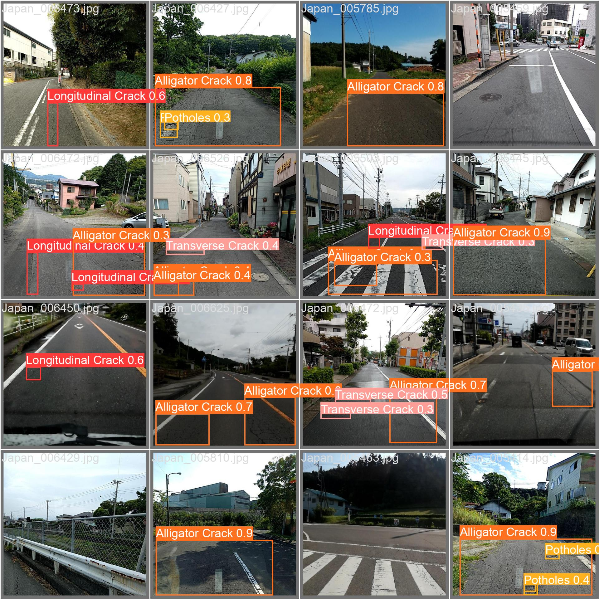

# Road Damage Detection Applications

This project is road damage detection applications that designed to enhance road safety and infrastructure maintenance by swiftly identifying and categorizing various forms of road damage, such as potholes and cracks.

## Performing Detection Using Image


## Performing Detection Using Video


The project is powered by YOLOv8 deep learning model that trained on Crowdsensing-based Road Damage Detection Challenge 2022 dataset.

There is four types of damage that this model can detects such as:
- Longitudinal Crack
- Transverse Crack
- Alligator Crack
- Potholes

## Running on Local Server

This is the step that you take to install and run the web-application on the local server.

``` bash
# Install CUDA if available
# https://docs.nvidia.com/cuda/cuda-installation-guide-linux/index.html

# Create the python environment
conda create -n rdd python=3.8
conda activate rdd

# Install pytorch-CUDA
# https://pytorch.org/get-started/locally/
conda install pytorch==2.0.0 torchvision==0.15.0 torchaudio==2.0.0 pytorch-cuda=11.8 -c pytorch -c nvidia

# Install ultralytics deep learning framework
# https://docs.ultralytics.com/quickstart/
pip install ultralytics

# Clone the repository
git clone https://github.com/oracl4/RoadDamageDetection.git
cd RoadDamageDetection

# Install requirements
pip install -r requirements.txt

# Start the streamlit webserver
streamlit run Home.py
```

## Web Demo

### [🎈Webserver Online Demo](https://roaddamagedetection.streamlit.app/)
    
    You can access the webserver demo on the streamlit cloud. But due to hardware limitations, some functions may not be working as intended. Such as, the realtime detection cannot capture the webcam input and slow inference on video detection.

## Training

### Prepare the Dataset

Download the datasets from this [github](https://github.com/sekilab/RoadDamageDetector) and you can extract the *RDD2022.zip* files into this structure.


Perform the dataset conversion from PascalVOC to YOLOv8 format using **0_PrepareDatasetYOLOv8.ipnb** notebook. This will also create a train and val split for the dataset due to lack of test labels on the original dataset. It will also remove excess background image from the dataset. It will copy the dataset and create a new directory on the training folder.


Run the training on **1_TrainingYOLOv8.ipynb** notebook. You can change the hyperparamter and training configuration on that notebook.

## Evaluation Result

This is the training result of the YOLOv8s model that trained on the filtered Japan and India dataset with RTX2060 GPU. You can perform the evaluation on your dataset with **2_EvaluationTesting.ipynb** notebook, just convert your dataset into ultralytics format.

<p align="center">
    
    
    
</p>

## License and Citations
- Road Damage Dataset from Crowdsensing-based Road Damage Detection Challenge (CRDDC2022)
- All rights reserved on YOLOv8 license permits by [Ultralytics](https://github.com/ultralytics/ultralytics) and [Streamlit](https://streamlit.io/) framework

---
This project is created for the [Road Damage Detection Challenge](https://s.id/RDDHariJalan23) by [Ministry of Public Works and Housing](https://pu.go.id/) for celebrating the "Peringatan Hari Jalan 2023"
